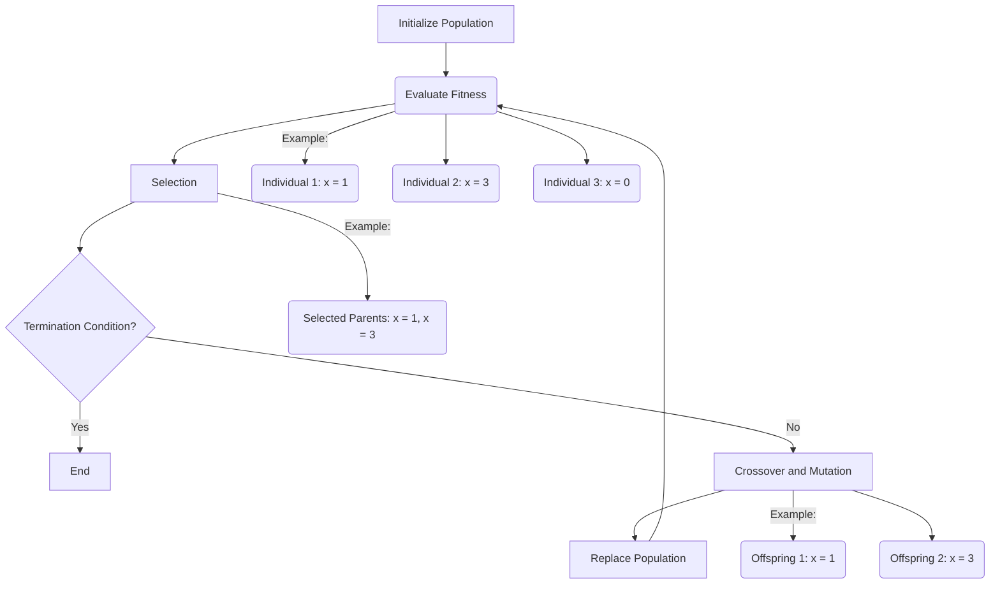

<!-- README.md is generated from README.Rmd. Please edit that file -->

```{r, include = FALSE}
knitr::opts_chunk$set(
  collapse = TRUE,
  comment = "#>",
  fig.path = "man/figures/README-",
  out.width = "100%"
)
```

# genetic.algo.optimizeR

<!-- badges: start -->
<!-- badges: end -->

The goal of `genetic.algo.optimizeR` is to optimize the function \( f(x) = x^2 - 4x + 4 \) using a genetic algorithm. The function represents a simple quadratic equation, and the goal is to find the value of \( x \) that minimizes the function.

Here's a breakdown of the aim and the results:

**Aim:**

- Optimize the function \( f(x) = x^2 - 4x + 4 \) to find the value of \( x \) that minimizes the function.

**Results:**

- **Initial Population**:

  - We start with a population of three individuals: \( x_1 = 1 \), \( x_2 = 3 \), and \( x_3 = 0 \).
<br>
- **Evaluation**:

  - We evaluate the fitness of each individual by calculating \( f(x) \) for each \( x \) value:
    - \( f(1) = 1^2 - 4*1 + 4 = 1 \)
    - \( f(3) = 3^2 - 4*3 + 4 = 1 \)
    - \( f(0) = 0^2 - 4*0 + 4 = 4 \)

- **Selection**:

  - We select individuals \( x_1 \) and \( x_2 \) as parents for crossover because they have higher fitness.

- **Crossover and Mutation**:

  - We perform crossover and mutation on the selected parents to generate offspring: \( x_1' = 1 \), \( x_2' = 3 \).

- **Replacement**:

  - We replace individual \( x_3 \) with offspring \( x_1' \), maintaining the population size.

After multiple generations of repeating these steps, the genetic algorithm aims to converge towards an optimal or near-optimal solution. In this example, since it's simple and the solution space is small, we could expect the algorithm to converge relatively quickly towards the optimal solution \( x = 2 \), where \( f(x) = 0 \).


***Explaining Graph***



## Usage
```{r usage}
library(genetic.algo.optimizeR)

# Initialize population
population <- initialize_population(population_size = 3, min = 0, max = 3)
print("Initial Population:")
print(population)

while (TRUE) {
  # Evaluate fitness
  fitness <- evaluate_fitness(population)
  print("Evaluation:")
  print(fitness)
  
  
  # Check if the fitness of every individual is close to zero
  if (all(abs(fitness) <= 0.01)) {
    print("Termination Condition Reached: All individuals have fitness close to zero.")
    break
  }
  
  # Selection
  selected_parents <- selection(population, fitness, num_parents = 2)
  print("Selection:")
  print(selected_parents)
  
  # Crossover and Mutation
  offspring <- crossover(selected_parents, offspring_size = 2)
  mutated_offspring <- mutation(offspring, mutation_rate = 0) #(no mutation in this example)
  print("Crossover and Mutation:")
  print(mutated_offspring)
  
  # Replacement
  population <- replacement(population, mutated_offspring, num_to_replace = 1)
  print("Replacement:")
  print(population)
}

```
The above example illustrates the process of a genetic algorithm, where individuals are selected, crossed over, and replaced iteratively to improve the population towards finding the optimal solution(i.e. fitting population).

1. Initialize Population:
   - Start with a population of individuals: X1(x=1), X2(x=3), X3(x=0).

2. Evaluate Fitness:
   - Calculate fitness for each individual:
     - X1: f(1) = 1^2 - 4*1 + 4 = 1
     - X2: f(3) = 3^2 - 4*3 + 4 = 1
     - X3: f(0) = 0^2 - 4*0 + 4 = 4

3. Selection:
   - Select parents for crossover:
     - Y1(x=1), Y2(x=3)

4. Crossover and Mutation:
   - Generate offspring through crossover and mutation:
     - Z1(x=1), Z2(x=3) (no mutation in this example)

5. Replacement:
   - Replace individuals in the population:
     - Replace X3 with Z1, maintaining the population size.

6. Repeat Steps 2-5 for multiple generations until a termination condition is met.


