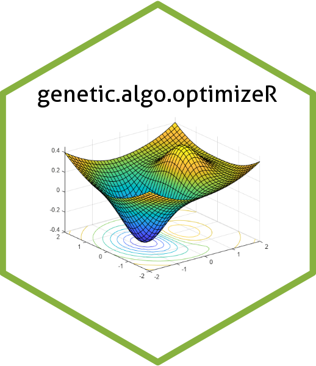
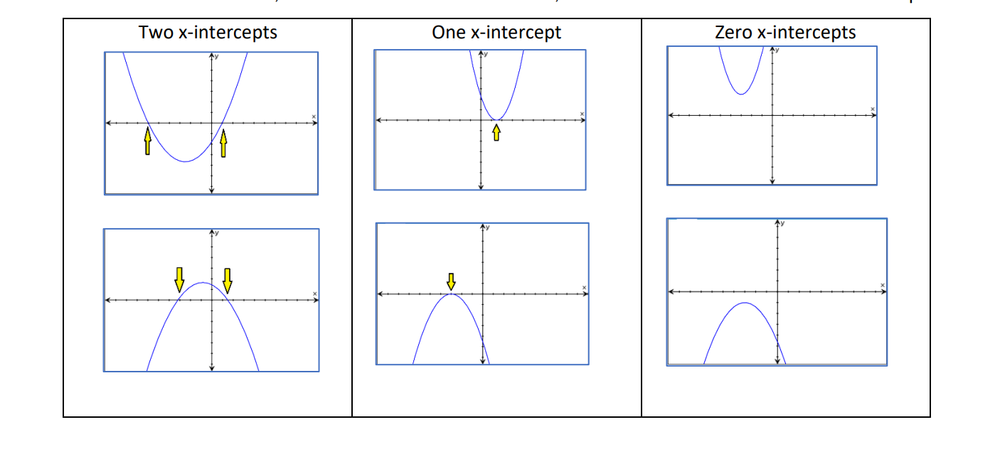

<!-- README.md is generated from README.Rmd. Please edit that file -->

```{r, include = FALSE}
knitr::opts_chunk$set(
    collapse = TRUE,
    comment = "#>",
    fig.path = "man/figures/README-",
    out.width = "100%"
)
```

# {genetic.algo.optimizeR} <a href="https://danymukesha.github.io/genetic.algo.optimizeR/"></a>

<!-- badges: start -->

[](https://github.com/danymukesha/genetic.algo.optimizeR/actions/workflows/R-CMD-check.yaml) [](https://CRAN.R-project.org/package=genetic.algo.optimizeR) [](https://mybinder.org/v2/gh/danymukesha/genetic.algo.optimizeR/main) [](https://lifecycle.r-lib.org/articles/stages.html#stable) [](https://app.codecov.io/gh/danymukesha/genetic.algo.optimizeR?branch=main)

<!-- badges: end -->

Genetic algorithms (GAs) are metaheuristic optimization techniques inspired by the principles of natural selection and evolution. They operate on a population of potential solutions, applying genetic operators such as selection, crossover, and mutation to evolve better solutions over successive generations[@whitley1994].

GAs are particularly useful for optimizing complex, non-linear functions with multiple local optima, where traditional gradient-based methods may fail[@holland1992; @goldberg1988].

We come out with a simple example to explore how these components work together in our quadratic function optimization problem using `genetic.algo.optimizeR` package.

The goal is to optimize the function $f(x) = x^2 - 4x + 4$ using a genetic algorithm. The function represents a simple quadratic equation, and the goal is to find the value of $x$ that minimizes the function.

Here's a breakdown of the aim and the results:

**Aim:**

-   Optimize the function $f(x) = x^2 - 4x + 4$ to find the value of $x$ that minimizes the function.

**Results:**

-   **Initial Population**:

    -   We start with a population of three individuals: $x_1 = 1$, $x_2 = 3$, and $x_3 = 0$. <br>

-   **Evaluation**:

    -   We evaluate the fitness of each individual by calculating $f(x)$ for each $x$ value:
        -   $f(1) = 1^2 - 4*1 + 4 = 1$
        -   $f(3) = 3^2 - 4*3 + 4 = 1$
        -   $f(0) = 0^2 - 4*0 + 4 = 4$

-   **Selection**:

    -   We select individuals $x_1$ and $x_2$ as parents for crossover because they have higher fitness.

-   **Crossover and Mutation**:

    -   We perform crossover and mutation on the selected parents to generate offspring: $x_1' = 1$, $x_2' = 3$.

-   **Replacement**:

    -   We replace individual $x_3$ with offspring $x_1'$, maintaining the population size.

After multiple generations of repeating these steps, the genetic algorithm aims to converge towards an optimal or near-optimal solution. In this example, since it's simple and the solution space is small, we could expect the algorithm to converge relatively quickly towards the optimal solution $x = 2$, where $f(x) = 0$.

[***wikipedia***](https://en.wikipedia.org/wiki/Genetic_algorithm)

```{r diagram_GAs, eval=FALSE, include=FALSE}
library(DiagrammeR)

grViz("
  digraph genetic_algorithm {
    rankdir=LR;
    
    A [label = 'Initialize Population'];
    B [label = 'Evaluate Fitness'];
    C [label = 'Selection'];
    D [label = 'Termination Condition?'];
    E [label = 'End'];
    F [label = 'Crossover and Mutation'];
    G [label = 'Replace Population'];
    
    X1 [label = 'Individual 1: x = 1', shape = ellipse];
    X2 [label = 'Individual 2: x = 3', shape = ellipse];
    X3 [label = 'Individual 3: x = 0', shape = ellipse];
    
    Y1 [label = 'Selected Parents: x = 1, x = 3', shape = ellipse];
    
    Z1 [label = 'Offspring 1: x = 1', shape = ellipse];
    Z2 [label = 'Offspring 2: x = 3', shape = ellipse];
    
    A -> B;
    B -> C;
    C -> D;
    D -> E [label = 'Yes'];
    D -> F [label = 'No'];
    F -> G;
    G -> B;
    
    # Examples
    B -> X1 [label = 'Example:'];
    B -> X2;
    B -> X3;
    
    C -> Y1 [label = 'Example:'];
    
    F -> Z1 [label = 'Example:'];
    F -> Z2;
  }
")

```


## Usage

```{r usage}
library(genetic.algo.optimizeR)

# Initialize population
population <- initialize_population(population_size = 3, min = 0, max = 3)
print("Initial Population:")
print(population)

generation <- 0 # Initialize generation/reputation counter

while (TRUE) {
    generation <- generation + 1 # Increment generation/reputation count

    # Evaluate fitness
    fitness <- evaluate_fitness(population)
    print("Evaluation:")
    print(fitness)


    # Check if the fitness of every individual is close to zero
    if (all(abs(fitness) <= 0.01)) {
        print("Termination Condition Reached: All individuals have fitness close to zero.")
        break
    }

    # Selection
    selected_parents <- selection(population, fitness, num_parents = 2)
    print("Selection:")
    print(selected_parents)

    # Crossover and Mutation
    offspring <- crossover(selected_parents, offspring_size = 2)
    mutated_offspring <- mutation(offspring, mutation_rate = 0) # (no mutation in this example)
    print("Crossover and Mutation:")
    print(mutated_offspring)

    # Replacement
    population <- replacement(population, mutated_offspring, num_to_replace = 1)
    print("Replacement:")
    print(population)
}

print(paste("Total generations/reputations:", generation))
```

The above example illustrates the process of a genetic algorithm, where individuals are selected, crossed over, and replaced iteratively to improve the population towards finding the optimal solution(i.e. fitting population).

***In theory***

1.  Initialize Population:

    -   Start with a population of individuals: X1(x=1), X2(x=3), X3(x=0).\
        (Note: the values are random and the population should be highly diversified)
    -   The space of x value is kept integer type and on range from 0 to 3,for simplification.

    ```{r population}
    population <- c(1, 3, 0)
    population
    ```

2.  Evaluate Fitness:

    -   Calculate fitness(`f(x)`) for each individual:

        -   X1: f(1) = 1\^2 - 4\*1 + 4 = 1
        -   X2: f(3) = 3\^2 - 4\*3 + 4 = 1
        -   X3: f(0) = 0\^2 - 4\*0 + 4 = 4

Coding the function f(x) in R A quadratic function is a function of the form: ax2+bx+c where a≠0

So for:

$$
f \left(x\right) = x^2 - 4x + 4
$$

In R, we write:

```{r f_function}
a <- 1
b <- -4
c <- 4
f <- function(x) {
    a * x^2 + b * x + c
}
```

Plotting the quadratic function f(x) First, we have to choose a domain over which we want to plot f(x).

Let’s try 0 ≤ x ≤ 3:

```{r initial_poputation, out.width="70%", fig.cap=""}
# domain over which we want to plot f(x)
x <- seq(from = 0, to = 4, length.out = 100)
# plot f(x)
plot(x, f(x), type = "l") # type = 'l' plots a line instead of points
# plot the x and y axes
abline(v = 0, h = 0, col = "skyblue", lty = 3)
points(c(1, 3), c(f(1), f(3)), col = "coral1", pch = 8, cex = 1.5, lty = 3)
text(c(1, 3), c(f(1), f(3)), labels = c("(x=1, f(x=1))", "(x=3, f(x=3))"), pos = 3)

points(c(0), c(f(0)), col = "blue", pch = 8, cex = 1.5, lty = 3)
text(c(0), c(f(0)), labels = "(x=0, f(x=0))", pos = 4, font = 2)
```

3.  Selection:
    -   Select parents for crossover:

        -   Y1(x=1), Y2(x=3)

```{r selection, out.width="70%", fig.cap=""}
# plot f(x)
plot(x, f(x), type = "l") # type = 'l' plots a line instead of points
# plot the x and y axes
points(c(1, 3), c(f(1), f(3)), col = "coral1", pch = 8, cex = 2, lty = 3)
text(c(1, 3), c(f(1), f(3)), labels = c("(x=1, f(x=1))", "(x=3, f(x=3))"), pos = 3, font = 2)
```

4.  Crossover and Mutation:
    -   Generate offspring through crossover and mutation:
        -   Z1(x=1), Z2(x=3) (no mutation in this example)
5.  Replacement:
    -   Replace individuals in the population:
        -   Replace X3 with Z1, maintaining the population size.
6.  Repeat Steps 2-5 for multiple generations until a termination condition is met.

The optimal/fitting individuals *F* of a quadratic equation, in this case the lowest point on the graph of f(x), is:

$$
F\left(\frac{-b}{2a}, f\left(\frac{-b}{2a}\right)\right)
$$

```{r fitting, out.width="70%", fig.cap=""}
find.fitting <- function(a, b, c) {
    x_fitting <- -b / (2 * a)
    y_fitting <- f(x_fitting)
    c(x_fitting, y_fitting)
}
F <- find.fitting(a, b, c)
```

Adding the Fitting to the plot:

```{r fitting_plot, out.width="70%", fig.cap=""}
# plot f(x)
plot(x, f(x), type = "l") # type = 'l' plots a line instead of points
# plot the x and y axes
abline(h = 0)
abline(v = 0)
# add the vertex to the plot
points(
    x = F[1], y = F[2],
    pch = 18, cex = 2, col = "red"
) # pch controls the form of the point and cex controls its size
# add a label next to the point
text(
    x = F[1], y = F[2],
    labels = "Fitting", pos = 3, col = "red", font = 10
) # pos = 3 places the text above the point
```

***Existing alternative solution***

Finding the x-intercepts of ***f(x)***

The x-intercepts are the solutions of the quadratic equation f(x) = 0; they can be found by using the quadratic formula:

$$
x = \frac{-b \pm \sqrt{b^2 - 4ac}}{2a}
$$

The quantity $b2–4ac$ is called the discriminant:

-   if the discriminant is positive, then *f(x)* has 2 solutions (i.e. x-intercepts).
-   if the discriminant is zero, then *f(x)* has 1 solution (i.e. 1 x-intercept).
-   if the discriminant is negative, then *f(x)* has no real solutions (i.e. does not intersect the x-axis).



```{r function_intercepts}
# find the x-intercepts of f(x)
find.roots <- function(a, b, c) {
    discriminant <- b^2 - 4 * a * c
    if (discriminant > 0) {
        c((-b - sqrt(discriminant)) / (2 * a), (-b + sqrt(discriminant)) / (2 * a))
    } else if (discriminant == 0) {
        -b / (2 * a)
    } else {
        NaN
    }
}
solutions <- find.roots(a, b, c)
```

Adding the x-intercepts to the plot:

```{r plot_intercepts, out.width="70%", fig.cap=""}
# plot f(x)
plot(x, f(x), type = "l") # type = 'l' plots a line instead of points
# plot the x and y axes
abline(h = 0)
abline(v = 0)
# add the x-intercepts to the plot
points(
    x = solutions, y = rep(0, length(solutions)), # x and y coordinates of the x-intercepts
    pch = 18, cex = 2, col = "red"
)
text(
    x = solutions, y = rep(0, length(solutions)),
    labels = rep("Fitting(x-intercept)", length(solutions)),
    pos = 3, col = "red", font = 10
)
```

We has demonstrated the application of genetic algorithm concepts to optimize a quadratic function. We've explored population initialization, fitness evaluation, selection, and visualization of results. We've also delved into the theoretical aspects of quadratic functions, including finding the optimal solution and x-intercepts.

Future developments could include:

-   Implementing more sophisticated crossover and mutation operators
-   Exploring multi-objective optimization problems
-   Applying GAs to more complex, higher-dimensional functions
-   Investigating hybrid algorithms that combine GAs with other optimization techniques

By understanding these fundamental concepts and their implementation, we can take advantage of genetic algorithms for a wide range of optimization problems across various domains.

## Advanced topics

### Multi-objective optimization

While our example focuses on single-objective optimization, genetic algorithms are particularly powerful for multi-objective problems. In such cases, the concept of Pareto optimality is used to evaluate solutions, and techniques like NSGA-II (Non-dominated Sorting Genetic Algorithm II) can be employed[@deb2002].

### Adaptive parameter control

The performance of genetic algorithms can be sensitive to parameter settings (e.g., mutation rate, crossover probability). Adaptive parameter control techniques adjust these parameters dynamically during the optimization process, potentially improving convergence and solution quality.

### Parallel implementation

Genetic algorithms are inherently parallelizable. Implementing parallel versions of selection, crossover, and mutation operations can significantly reduce computation time for large-scale optimization problems.

## Wrap-up

Currently only the fundamental concepts and implementation of genetic algorithms are used in the `genetic.algo.optimizeR` package. By following these steps and understanding the underlying principles, users can apply this powerful optimization technique to a wide range of problems in fields such as engineering, finance, and bioinformatics.

Future developments of the package may include:

1.  Implementation of more advanced selection methods (e.g., tournament selection)
2.  Support for constraint handling in optimization problems
3.  Integration with other R optimization packages for hybrid algorithms

I would encourage the users to experiment with different parameter settings and problem formulations to gain deeper insights into the behavior and capabilities of genetic algorithms.

## References

