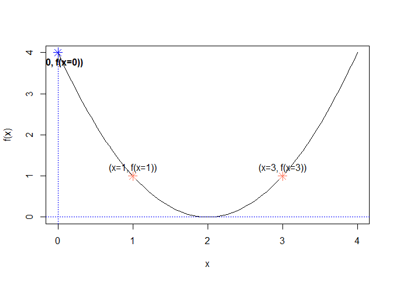
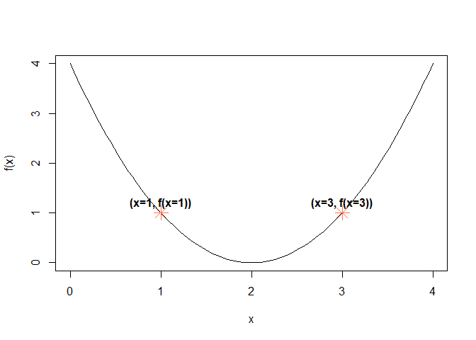
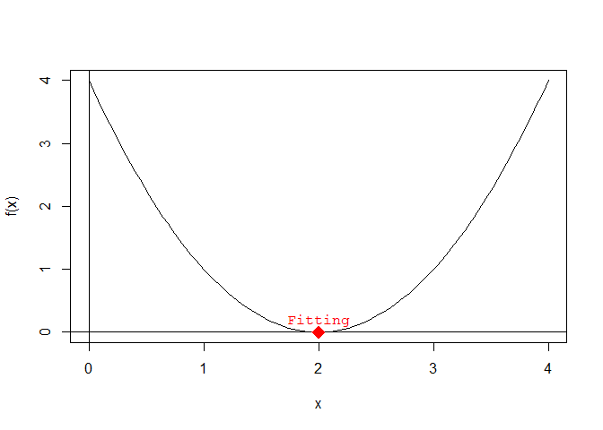
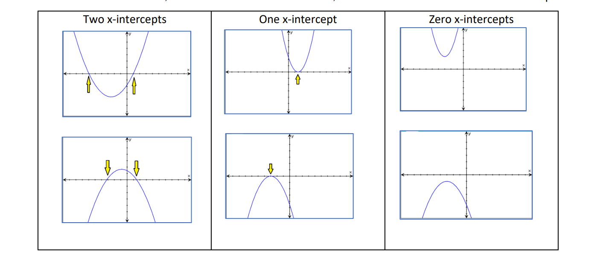
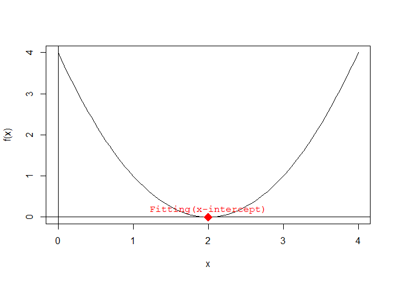

<!-- README.md is generated from README.Rmd. Please edit that file -->

# {genetic.algo.optimizeR} <a href="https://danymukesha.github.io/genetic.algo.optimizeR/"></a>

<!-- badges: start -->

[](https://github.com/danymukesha/genetic.algo.optimizeR/actions/workflows/R-CMD-check.yaml)
[](https://CRAN.R-project.org/package=genetic.algo.optimizeR)
[](https://mybinder.org/v2/gh/danymukesha/genetic.algo.optimizeR/main)
[](https://lifecycle.r-lib.org/articles/stages.html#stable)
[](https://app.codecov.io/gh/danymukesha/genetic.algo.optimizeR?branch=main)
<!-- badges: end -->

The goal of `genetic.algo.optimizeR` is to optimize the function
$f(x) = x^2 - 4x + 4$ using a genetic algorithm. The function represents
a simple quadratic equation, and the goal is to find the value of $x$
that minimizes the function.

Here’s a breakdown of the aim and the results:

**Aim:**

- Optimize the function $f(x) = x^2 - 4x + 4$ to find the value of $x$
  that minimizes the function.

**Results:**

- **Initial Population**:

  - We start with a population of three individuals: $x_1 = 1$,
    $x_2 = 3$, and $x_3 = 0$. <br>

- **Evaluation**:

  - We evaluate the fitness of each individual by calculating $f(x)$ for
    each $x$ value:
    - $f(1) = 1^2 - 4*1 + 4 = 1$
    - $f(3) = 3^2 - 4*3 + 4 = 1$
    - $f(0) = 0^2 - 4*0 + 4 = 4$

- **Selection**:

  - We select individuals $x_1$ and $x_2$ as parents for crossover
    because they have higher fitness.

- **Crossover and Mutation**:

  - We perform crossover and mutation on the selected parents to
    generate offspring: $x_1' = 1$, $x_2' = 3$.

- **Replacement**:

  - We replace individual $x_3$ with offspring $x_1'$, maintaining the
    population size.

After multiple generations of repeating these steps, the genetic
algorithm aims to converge towards an optimal or near-optimal solution.
In this example, since it’s simple and the solution space is small, we
could expect the algorithm to converge relatively quickly towards the
optimal solution $x = 2$, where $f(x) = 0$.

[***Explaining
Graph***](https://danymukesha.github.io/genetic.algo.optimizeR/articles/explaining_graph.html)


## Usage

``` r
library(genetic.algo.optimizeR)

# Initialize population
population <- initialize_population(population_size = 3, min = 0, max = 3)
print("Initial Population:")
#> [1] "Initial Population:"
print(population)
#> [1] 0 1 3

generation <- 0 # Initialize generation/reputation counter

while (TRUE) {
  generation <- generation + 1 # Increment generation/reputation count

  # Evaluate fitness
  fitness <- evaluate_fitness(population)
  print("Evaluation:")
  print(fitness)


  # Check if the fitness of every individual is close to zero
  if (all(abs(fitness) <= 0.01)) {
    print("Termination Condition Reached: All individuals have fitness close to zero.")
    break
  }

  # Selection
  selected_parents <- selection(population, fitness, num_parents = 2)
  print("Selection:")
  print(selected_parents)

  # Crossover and Mutation
  offspring <- crossover(selected_parents, offspring_size = 2)
  mutated_offspring <- mutation(offspring, mutation_rate = 0) # (no mutation in this example)
  print("Crossover and Mutation:")
  print(mutated_offspring)

  # Replacement
  population <- replacement(population, mutated_offspring, num_to_replace = 1)
  print("Replacement:")
  print(population)
}
#> [1] "Evaluation:"
#> [1] 4 1 1
#> [1] "Selection:"
#> [1] 1 3
#> [1] "Crossover and Mutation:"
#> [1] 2 2
#> [1] "Replacement:"
#> [1] 0 1 2
#> [1] "Evaluation:"
#> [1] 4 1 0
#> [1] "Selection:"
#> [1] 2 1
#> [1] "Crossover and Mutation:"
#> [1] 2 2
#> [1] "Replacement:"
#> [1] 2 1 2
#> [1] "Evaluation:"
#> [1] 0 1 0
#> [1] "Selection:"
#> [1] 2 2
#> [1] "Crossover and Mutation:"
#> [1] 2 2
#> [1] "Replacement:"
#> [1] 2 2 2
#> [1] "Evaluation:"
#> [1] 0 0 0
#> [1] "Termination Condition Reached: All individuals have fitness close to zero."

print(paste("Total generations/reputations:", generation))
#> [1] "Total generations/reputations: 4"
```

The above example illustrates the process of a genetic algorithm, where
individuals are selected, crossed over, and replaced iteratively to
improve the population towards finding the optimal solution(i.e. fitting
population).

***In theory***

1.  Initialize Population:

    - Start with a population of individuals: X1(x=1), X2(x=3),
      X3(x=0).  
      (Note: the values are random and the population should be highly
      diversified)
    - The space of x value is kept integer type and on range from 0 to
      3,for simplification.

    ``` r
    population <- c(1, 3, 0)
    population
    #> [1] 1 3 0
    ```

2.  Evaluate Fitness:

    - Calculate fitness(`f(x)`) for each individual:

      - X1: f(1) = 1^2 - 4\*1 + 4 = 1
      - X2: f(3) = 3^2 - 4\*3 + 4 = 1
      - X3: f(0) = 0^2 - 4\*0 + 4 = 4

Coding the function f(x) in R A quadratic function is a function of the
form: ax2+bx+c where a≠0

So for:

$$
f \left(x\right) = x^2 - 4x + 4
$$

In R, we write:

``` r
a <- 1
b <- -4
c <- 4
f <- function(x) {
  a * x^2 + b * x + c
}
```

Plotting the quadratic function f(x) First, we have to choose a domain
over which we want to plot f(x).

Let’s try 0 ≤ x ≤ 3:

``` r
# domain over which we want to plot f(x)
x <- seq(from = 0, to = 4, length.out = 100)
# plot f(x)
plot(x, f(x), type = "l") # type = 'l' plots a line instead of points
# plot the x and y axes
abline(v = 0, h = 0, col = "skyblue", lty = 3)
points(c(1, 3), c(f(1), f(3)), col = "coral1", pch = 8, cex = 1.5, lty = 3)
text(c(1, 3), c(f(1), f(3)), labels = c("(x=1, f(x=1))", "(x=3, f(x=3))"), pos = 3)

points(c(0), c(f(0)), col = "blue", pch = 8, cex = 1.5, lty = 3)
text(c(0), c(f(0)), labels = "(x=0, f(x=0))", pos = 4, font = 2)
```



3.  Selection:
    - Select parents for crossover:

      - Y1(x=1), Y2(x=3)

``` r
# plot f(x)
plot(x, f(x), type = "l") # type = 'l' plots a line instead of points
# plot the x and y axes
points(c(1, 3), c(f(1), f(3)), col = "coral1", pch = 8, cex = 2, lty = 3)
text(c(1, 3), c(f(1), f(3)), labels = c("(x=1, f(x=1))", "(x=3, f(x=3))"), pos = 3, font = 2)
```



4.  Crossover and Mutation:
    - Generate offspring through crossover and mutation:
      - Z1(x=1), Z2(x=3) (no mutation in this example)
5.  Replacement:
    - Replace individuals in the population:
      - Replace X3 with Z1, maintaining the population size.
6.  Repeat Steps 2-5 for multiple generations until a termination
    condition is met.

The optimal/fitting individuals *F* of a quadratic equation, in this
case the lowest point on the graph of f(x), is:

$$
F\left(\frac{-b}{2a}, f\left(\frac{-b}{2a}\right)\right)
$$

``` r
find.fitting <- function(a, b, c) {
  x_fitting <- -b / (2 * a)
  y_fitting <- f(x_fitting)
  c(x_fitting, y_fitting)
}
F <- find.fitting(a, b, c)
```

Adding the Fitting to the plot:

``` r
# plot f(x)
plot(x, f(x), type = "l") # type = 'l' plots a line instead of points
# plot the x and y axes
abline(h = 0)
abline(v = 0)
# add the vertex to the plot
points(
  x = F[1], y = F[2],
  pch = 18, cex = 2, col = "red"
) # pch controls the form of the point and cex controls its size
# add a label next to the point
text(
  x = F[1], y = F[2],
  labels = "Fitting", pos = 3, col = "red", font = 10
) # pos = 3 places the text above the point
```



***Existing alternative solution***

Finding the x-intercepts of ***f(x)***

The x-intercepts are the solutions of the quadratic equation f(x) = 0;
they can be found by using the quadratic formula:

$$
x = \frac{-b \pm \sqrt{b^2 - 4ac}}{2a}
$$

The quantity $b2–4ac$ is called the discriminant:

- if the discriminant is positive, then *f(x)* has 2 solutions
  (i.e. x-intercepts).
- if the discriminant is zero, then *f(x)* has 1 solution (i.e. 1
  x-intercept).
- if the discriminant is negative, then *f(x)* has no real solutions
  (i.e. does not intersect the x-axis).



``` r
# find the x-intercepts of f(x)
find.roots <- function(a, b, c) {
  discriminant <- b^2 - 4 * a * c
  if (discriminant > 0) {
    c((-b - sqrt(discriminant)) / (2 * a), (-b + sqrt(discriminant)) / (2 * a))
  } else if (discriminant == 0) {
    -b / (2 * a)
  } else {
    NaN
  }
}
solutions <- find.roots(a, b, c)
```

Adding the x-intercepts to the plot:

``` r
# plot f(x)
plot(x, f(x), type = "l") # type = 'l' plots a line instead of points
# plot the x and y axes
abline(h = 0)
abline(v = 0)
# add the x-intercepts to the plot
points(
  x = solutions, y = rep(0, length(solutions)), # x and y coordinates of the x-intercepts
  pch = 18, cex = 2, col = "red"
)
text(
  x = solutions, y = rep(0, length(solutions)),
  labels = rep("Fitting(x-intercept)", length(solutions)),
  pos = 3, col = "red", font = 10
)
```


